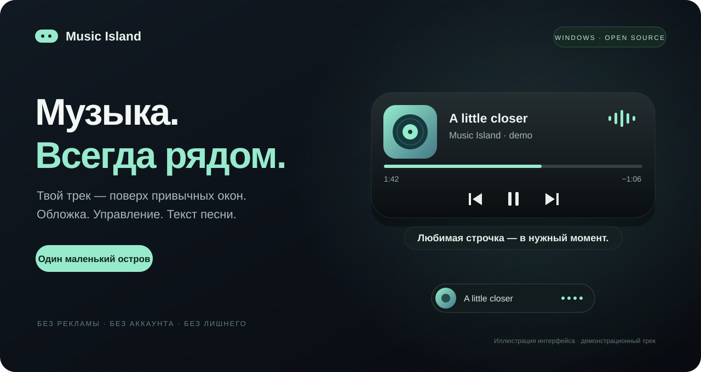

<div align="center">



<br>


**Твой трек. Твои окна. Один маленький остров.**

[**Скачать для Windows ↓**](https://github.com/shhhh007/music-island/releases/latest) · [Установка](docs/INSTALL.md) · [Управление](#управление) · [English](docs/README.en.md)

</div>

---

Music Island — музыкальный плеер-оверлей для Windows. Он показывает текущий трек поверх приложений, раскрывается плавным движением и сворачивается в компактную капсулу. Обложка, пауза, переключение треков и любимая строка песни — без постоянного переключения окон.

**Без рекламы, аккаунта и подписки. Исходный код открыт.**

## Маленький остров, всё нужное

| | |
|---|---|
| **Твой трек на виду** | Название, исполнитель, обложка и прогресс из медиасессий Windows. |
| **Цвет твоей музыки** | Акцент автоматически подстраивается под обложку. Можно выбрать свой. |
| **Движение без дёрганья** | Пружинное раскрытие, плавная смена строк и бегущий текст. |
| **Текст в нужный момент** | Синхронные строки из LRCLIB — под островом или внутри него. |
| **Настрой под себя** | Масштаб, положение, фон, автосворачивание, часы и пропуск кликов. |
| **Поверх рабочего стола и игр** | Остров не забирает фокус. Для игр нужен оконный режим без рамок. |

## Установка

### Самый простой способ

1. **[Скачай установщик](https://github.com/shhhh007/music-island/releases/latest/download/Music-Island-1.0.0-Setup.exe)**.
2. Запусти **Music-Island-1.0.0-Setup.exe** и нажми **Установить**.
3. Включи музыку в SoundCloud или другом совместимом плеере.

Готово: остров появится у верхнего края экрана, ярлыки — на рабочем столе и в меню «Пуск». Права администратора не нужны.

<details>
<summary><strong>Хочу переносимую версию / подробнее об установке</strong></summary>

Скачай [portable ZIP](https://github.com/shhhh007/music-island/releases/latest/download/Music-Island-1.0.0-portable.zip), извлеки **все файлы** в отдельную папку и запусти `Music Island.exe`. Все DLL и PS1 должны оставаться рядом с ним.

Нужны Windows 10 1809+ / Windows 11 x64, .NET Framework 4.8 и Windows PowerShell 5.1. Установщик пока без подписи издателя; в релизе есть SHA-256 и исходный код. Программа не добавляет себя в автозагрузку.

**Совместимость с защитой Windows:** опубликованный релиз 1.0.0 не подписан и может блокироваться Smart App Control. Наличие проекта на GitHub и SHA-256 не заменяет доверенную подпись. Исправления текста и оптимизации в `main` пока не входят в установщик 1.0.0. [Статус и подготовка подписанного выпуска](docs/SIGNING.md).

[Полная инструкция: установка, обновление и удаление →](docs/INSTALL.md)

</details>

## Управление

| Действие | Как |
|---|---|
| Развернуть / свернуть | Щелчок по фону острова |
| Пауза, предыдущий, следующий | Кнопки в раскрытом режиме |
| Перемотать | Нажать или перетащить шкалу прогресса* |
| Открыть настройки | Правая кнопка мыши |
| Скрыть / показать | **Ctrl + Alt + I** |
| Вернуть клики после режима пропуска | Значок в трее → «Вернуть управление мышью» |
| Закрыть приложение | Значок в трее → «Выход» |

\* Когда плеер поддерживает перемотку. Автосворачивание срабатывает через 6 секунд, если курсор вне острова.

## Что работает у каждого

Приложение уже пригодно для самостоятельного использования — исходный Lua и игра не нужны.

| Возможность | Обычная установка | С совместимым сервером на localhost |
|---|:---:|:---:|
| Название, исполнитель, обложка | ✓ | ✓ |
| Поддерживаемые плеером медиакнопки и перемотка | ✓ | ✓ |
| Цвет обложки, часы, настройки | ✓ | ✓ |
| Синхронный текст по строкам | LRCLIB | Сервер / LRCLIB |
| Частотный эквалайзер | — | ✓, если сервер отдаёт частоты |
| Громкость конкретного приложения | — | ✓, если сервер её предоставляет |
| Подсветка текста по словам | — | ✓, если есть тайминги слов |

**Опциональный сервер `127.0.0.1:8770` не входит в установщик.** Без частотных данных эквалайзер остаётся аккуратными точками. Случайная анимация не выдаётся за анализ музыки.

Для отображения метаданных браузер или плеер должен предоставлять медиасессию Windows. Произвольный звук без медиаданных не сообщает название и обложку. Текст может отсутствовать, а тайминги ремиксов — отличаться. Эксклюзивный fullscreen и защищённые экраны Windows не поддерживаются.

## Приватность

Нет аналитики и записи звука. Для поиска текста LRCLIB получает название, исполнителя и длительность. Настройки и журналы ошибок остаются локально. [Подробнее →](docs/PRIVACY.md)

## Для разработчиков

```powershell
# Собрать приложение
powershell -NoProfile -ExecutionPolicy Bypass -File .\build.ps1

# Проверить интерфейс на тестовых данных
powershell -NoProfile -ExecutionPolicy Bypass -File .\test.ps1

# Получить установщик, portable ZIP и контрольные суммы
powershell -NoProfile -ExecutionPolicy Bypass -File .\package.ps1
```

Сборка использует компоненты Windows и .NET Framework. Node.js, Python и отдельный .NET SDK не нужны. [Архитектура и разработка →](docs/DEVELOPMENT.md)

## Есть идея или ошибка?

[Сообщить об ошибке](https://github.com/shhhh007/music-island/issues/new/choose) · [Предложить улучшение](https://github.com/shhhh007/music-island/issues) · [Участие в проекте](CONTRIBUTING.md)

---

<div align="center">

**Сделано для тех, кто не хочет терять свою музыку из виду.**

[MIT](LICENSE) · Music Island

</div>
