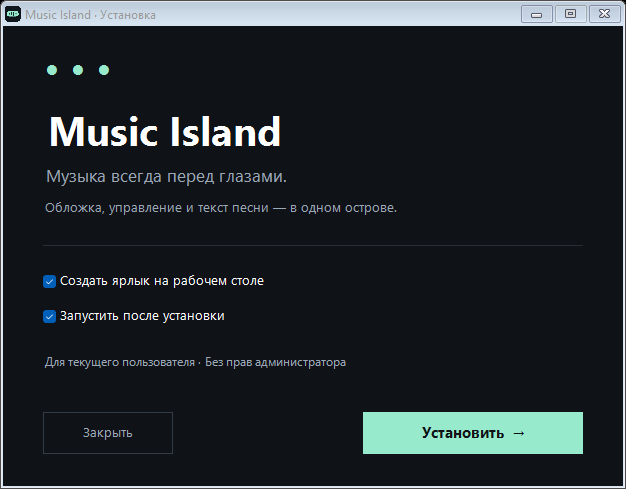

# Установка за минуту

## Вариант 1 — установщик

1. Откройте **Releases → Latest** на странице проекта.
2. Скачайте файл **Music-Island-1.0.0-Setup.exe** из раздела Assets.
3. Запустите его и нажмите **Установить**.

Установщик не требует прав администратора. Приложение появится в меню «Пуск», а по умолчанию — ещё и на рабочем столе. Папка установки: `%LocalAppData%\Programs\Music Island`.

Откройте SoundCloud или другой плеер, включите музыку и щёлкните по острову сверху экрана. Щелчок правой кнопкой открывает настройки. **Ctrl+Alt+I** скрывает и показывает остров.

## Вариант 2 — без установки

Скачайте **Music-Island-1.0.0-portable.zip**, извлеките **всё содержимое** в отдельную папку и запустите `Music Island.exe`. Не запускайте EXE прямо из ZIP и не переносите его отдельно от остальных файлов.

## Требования

- Windows 10 версии 1809 или новее / Windows 11, x64.
- .NET Framework 4.8 и Windows PowerShell 5.1. На актуальных Windows они обычно уже доступны; установщик не загружает компоненты системы.
- Для текста из LRCLIB требуется интернет. Для обложки и управления — плеер с медиасессией Windows.
- Для отображения поверх игры выберите **оконный режим без рамок**.

Приложение пока не имеет подписи издателя. Скачивайте его со страницы Releases проекта; контрольные суммы находятся в `SHA256SUMS.txt`. При сомнениях можно собрать приложение из опубликованных исходников. Отключать защиту Windows не требуется.

## Обновление

Закройте остров через значок в трее и запустите новый установщик. Личные настройки сохранятся. Для portable-версии замените файлы приложения после закрытия, оставив свой `settings.json`.

## Удаление

Для установленной версии: **Пуск → Music Island → Удалить Music Island**. Удаляются только файлы из манифеста установки и ярлыки этой копии. Настройки и локальные журналы сохраняются.

Для portable-версии: закройте остров в трее и удалите его папку.

## Если что-то не работает

| Ситуация | Что проверить |
|---|---|
| Ничего не видно | Ctrl+Alt+I; значок Music Island в трее; не запущена ли уже другая копия. |
| Не виден трек | Появляется ли он в системных медиакнопках Windows? Сайт должен передавать медиаданные браузеру. |
| Нет длительности или перемотки | Эти функции должен предоставлять сам плеер. |
| Нет текста | Текст может отсутствовать в LRCLIB. Ремикс может иметь другое название или тайминги. |
| Эквалайзер остаётся точками | Частотные данные доступны только при подключённом совместимом локальном сервере. |
| Нет поверх игры | Используйте оконный режим без рамок; эксклюзивный fullscreen не поддерживается. |
| Мышь проходит сквозь остров | В трее выберите «Вернуть управление мышью». |

Если проблема сохраняется, создайте Issue и укажите версию Windows, браузер / плеер, версию приложения и шаги воспроизведения. Не публикуйте личные журналы целиком: они могут содержать названия прослушанных треков.
